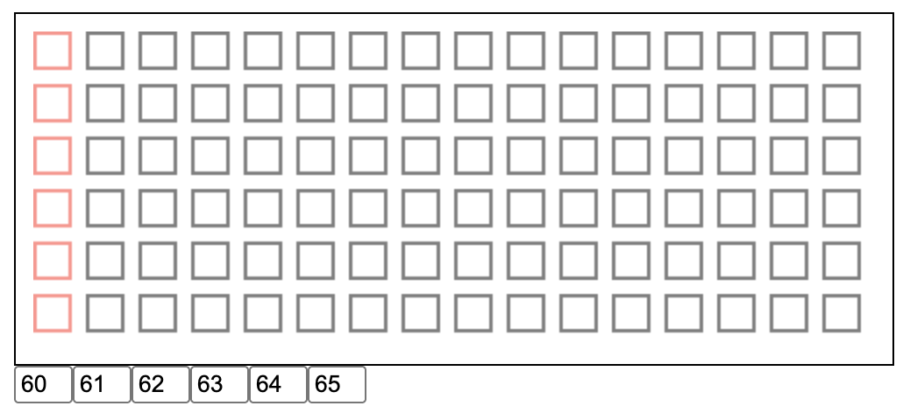

# WebMIDI Sequencer

A minimal browser-based step sequencer that sends notes over MIDI using the Web MIDI API.

## Features

- 6-track x 16-step grid sequencer
- 120 BPM default tempo (subdivided into 16th notes)
- Click steps to toggle them on/off
- Editable MIDI note numbers per track (defaults to MIDI notes 60–65)
- Sends Note On/Off messages to a MIDI output device
- Spacebar to start/stop playback

## Usage

1. Open `seq.html` in a browser that supports the Web MIDI API (e.g. Chrome or Edge)
2. Grant MIDI access when prompted
3. Update the MIDI output port ID in `seq.js` (`sendNote` call in `playNote`) to match your device
4. Click squares in the grid to activate steps
5. Press **Space** to start/stop the sequencer

## Configuration

Edit the constants at the top of `seq.js`:

| Variable | Default | Description |
|---|---|---|
| `bpm` | `120` | Tempo in beats per minute |
| `grid_width` | `16` | Number of steps per track |
| `grid_height` | `6` | Number of tracks |
| `midi_root_note` | `60` | Starting MIDI note (middle C) |
| `gate_time` | `200` | Note duration in milliseconds |

To find your MIDI output port ID, call `listInputsAndOutputs()` in the browser console after the page loads and copy the port `id` into the `playNote` function.

## Requirements

- A browser with [Web MIDI API](https://developer.mozilla.org/en-US/docs/Web/API/Web_MIDI_API) support
- A connected MIDI output device or virtual MIDI port
